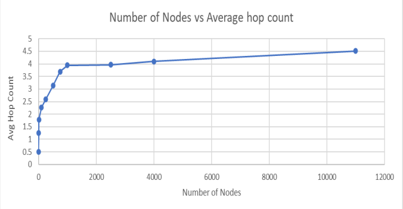

# Chord-Protocol
#### Academic Project
This project implements the Chord Communication Algorithm using Akka.NET. Chord nodes can join a ring,
query for keys, perform operations on the finger tables and collect statistics pertaining to the
number of hops made by messages.

## How to Build & Run:
```sh
dotnet build
dotnet run numberOfNodes numberOfRequestsPerNode
```

## Average Hop Count based on number of nodes

